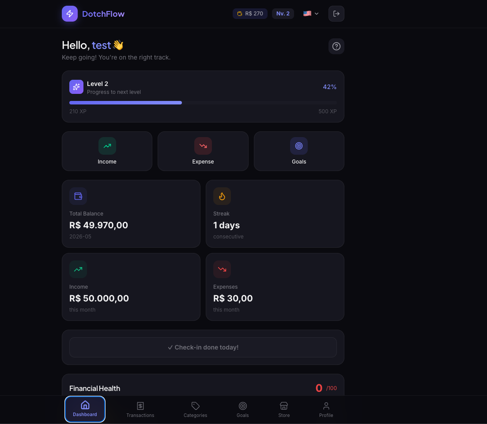

# DotchFlow



Gamified personal finance tracker — turn financial control into a motivating experience with XP, levels, streaks, and a reward store.

> **Note:** This is a test/learning project built with the help of AI (Claude by Anthropic). The full prompts and specs used to generate this project are documented in [`PROJECT.md`](PROJECT.md).

## What it does

- **Dashboard** — balance overview, XP, streak, and charts
- **Transactions** — quick income/expense recording with categories
- **Financial Health** — analysis using the 50-15-35 rule (essentials / priorities / lifestyle)
- **Balance Forecast** — 30-day projection based on recurring transactions
- **Goals (Dreams)** — track financial objectives with monthly savings targets
- **Gamification** — daily check-ins, XP, levels, DotchCoins, and streaks
- **Store** — unlock themes and features with earned coins
- **Multi-language** — English, Spanish, Portuguese (BR)

## Tech Stack

| Layer | Stack |
|-------|-------|
| Frontend | React + Vite, Tailwind CSS, Recharts, Zustand, react-i18next |
| Backend | Node.js + Express, SQLite (sql.js), JWT |
| Docs | Swagger / OpenAPI at `/api-docs` |

## Quick Start

### Backend

```bash
cd backend
npm install
cp .env.example .env   # set JWT_SECRET
npm run dev            # http://localhost:3001
```

First-time setup with seed data:

```bash
npm run dev-seed
```

Test credentials after seed: `test@dotchflow.com` / `myPassword123`

### Frontend

```bash
cd frontend
npm install
npm run dev            # http://localhost:5173
```

Frontend expects the API at `http://localhost:3001`. Change in `src/api/client.js` if needed.

## Testing

```bash
# Backend (Jest + Supertest)
cd backend && npm test

# Frontend (Vitest + Testing Library)
cd frontend && npm run test:run
```

## Project Structure

```
DotchFlow/
├── backend/        # REST API (Clean Architecture)
│   ├── src/
│   │   ├── domain/     # Entities & use cases
│   │   ├── infra/      # Repositories & database
│   │   └── ui/         # Controllers & routes
│   └── README.md   # Full API docs & endpoints
└── frontend/       # React SPA
    ├── src/
    │   ├── pages/
    │   ├── components/
    │   ├── store/
    │   └── i18n/
    └── README.md   # Frontend setup & structure
```

See [`backend/README.md`](backend/README.md) for full API reference and [`frontend/README.md`](frontend/README.md) for frontend details.
